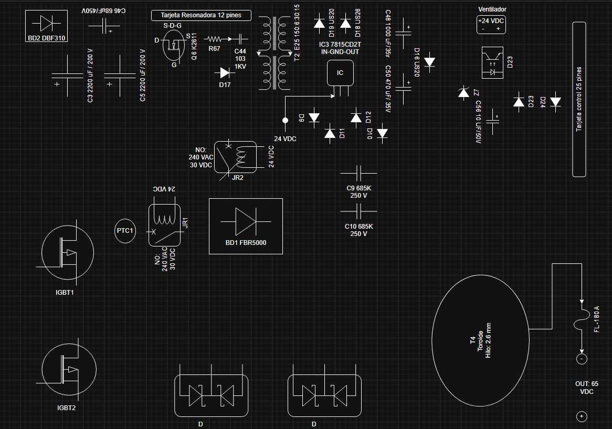
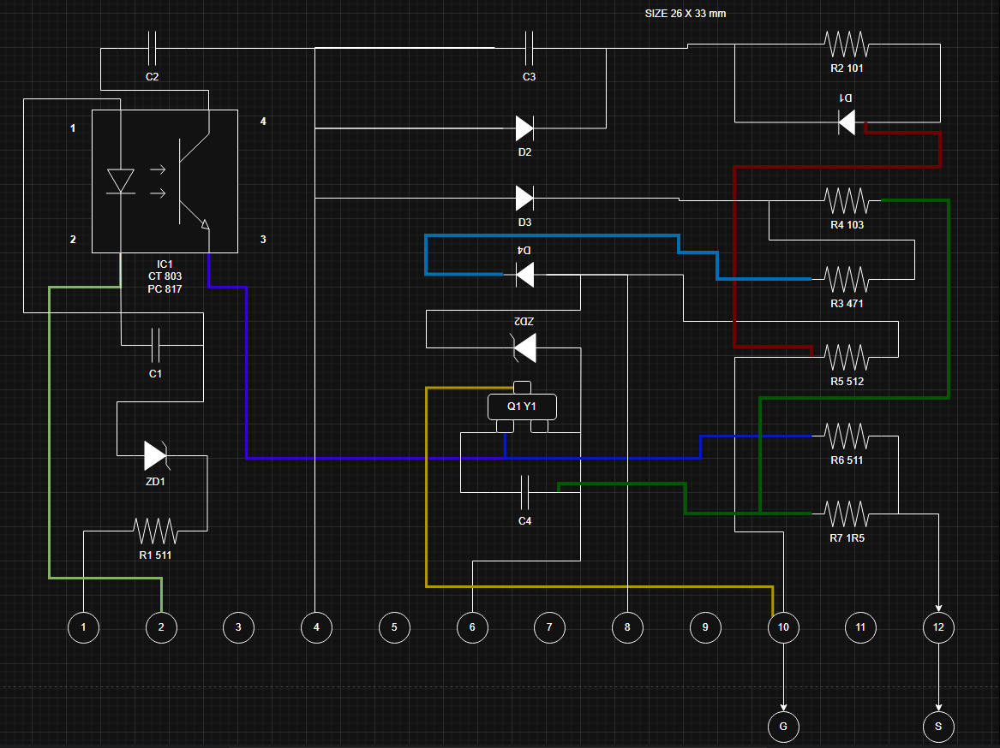

# Maquina-de-Soldar-Furius-Fix-201
Maquina de Soldar Furius Fix 201

---

Tarjeta resonadora

---

# Información Técnica de Componentes - Tarjeta Soldador Furius XT201

## 1. Listado de Componentes y Números de Parte

| Componente                    | Número de Parte (P/N)         | Serigrafía / Referencia Interna                                          | Descripción Corta                                                              |
| :---------------------------- | :---------------------------- | :----------------------------------------------------------------------- | :----------------------------------------------------------------------------- |
| **IGBT**                      | **60T65PES**         | FW201-015 (Referencia UJUETA)                                       | IGBT de **60A y 650V**. Utilizado en los equipos FIX 200 y FIX 201. |
| **Diodos de Salida**          | **SFA70UP20DN**      | FW201-008 (Referencia UJUETA)                                       | Diodos ultrafast duales de **70A y 200V**. Ubicados en el disipador de salida. |
| **Diodos de Salida de T2**    | No especificado [conversation] | **D19, D18** [conversation]                                              | Diodos SMD a la salida del transformador T2 (el *chopper*) [conversation].     |
| **Puente Rectificador Principal** | **BR5010**           | **BR5010** (serigrafía en placa)                                    | Puente de diodos rectificador de **50A, 700V(rms) - 1000V(rrm)**. |
| **MOSFET Fuente Auxiliar**    | **K2611**            | **Q7** (en conversación), FW201-06C (Referencia UJUETA)             | Transistor MOSFET **9A-900V**. Encargado de la fuente auxiliar. |
| **Puente Rectificador Auxiliar** | **DBF310**                | **DB2** con serigrafía **DBF310** (mencionado previamente en conversación) | Rectificador de puente de montaje superficial de **3A y 1000V** VRRM. Adecuado para rectificación de onda completa AC a DC. |
| **Optoacoplador**             | **PC817** / **CT803** | No especificado [conversation]                                           | Optoacoplador, puede presentar cortocircuitos o aislarse.         |
| **Regulador de Voltaje**      | **L7815** (SMD)          | FW205-909 (Referencia UJUETA)                                       | Regulador de voltaje SMD de **15V**.                                  |

## 2. Medidas en Frío de Componentes (Modo Diodo)

| Componente                    | Tipo de Medición          | Valores Obtenidos (en polarización directa / mV) | Notas                                                                                                                                                                                                                                                                                                                             |
| :---------------------------- | :------------------------ | :----------------------------------------------- | :-------------------------------------------------------------------------------------------------------------------------------------------------------------------------------------------------------------------------------------------------------------------------------------------------------------------------------- |
| **IGBTs**                     | Modo diodo                | Entre los puntos 1 y 2: **378 mV**               | Se entiende el formato de los puntos de medición del IGBT. El datasheet del MBQ60T65PES no especifica una Vf directa para el IGBT, sino un **voltaje directo de diodo (VF)** de **1.45V** (típico a 25°C, IF=25A). Las mediciones en frío con multímetro suelen ser menores debido a la baja corriente de prueba. |
|                               |                           | Entre los puntos 2 y 3: **413 mV**               |                                                                                                                                                                                                                                                                                                                                   |
|                               |                           | Entre los puntos 1 y 3: **420 mV**               |                                                                                                                                                                                                                                                                                                                                   |
| **Diodos D19 y D18**          | Vf (voltaje directo)      | **440 mV** (ambos)                               | Estos diodos SMD se encuentran a la salida del transformador T2 (el *chopper*) [conversation]. No se tiene un datasheet específico para estos diodos.                                                                                                                                                                            |
| **Diodos de Salida**          | Vf (voltaje directo)      | **414 mV** (para ambos)                          | Se refiere a los diodos **SFA70UP20DN**. El datasheet del SFA70UP20DN especifica un **voltaje directo (VF)** típico de **0.96V** (a 25°C, IF=35A). Las mediciones en frío con multímetro suelen ser menores debido a la baja corriente de prueba, pero son consistentes entre sí.                                      |
| **Puente Rectificador Principal** | Vf (voltaje directo)      | **490 mV**                                       | Mediciones para los cuatro diodos internos del puente rectificador **BR5010 / FBR5010** [conversation, 16]. El datasheet del FBR5000 - FBR5010 especifica un **voltaje directo máximo por diodo (VF)** de **1.3 Volts** (a IF = 25A). Las lecturas son consistentes y significativamente menores que el máximo, lo cual es esperable. |
|                               |                           | **493 mV**                                       |                                                                                                                                                                                                                                                                                                                                   |
|                               |                           | **486 mV**                                       |                                                                                                                                                                                                                                                                                                                                   |
|                               |                           | **498 mV**                                       |                                                                                                                                                                                                                                                                                                                                   |

---

## 1. Listado de Componentes y Números de Parte

| Componente | Número de Parte (P/N) | Serigrafía / Referencia Interna | Descripción Corta |
| :--- | :--- |:--- |:--- |
| **IGBT** | **60T65PES** | FW201-015 (Referencia UJUETA) | IGBT de **60A y 650V**. Utilizado en los equipos FIX 200 y FIX 201. [1] |
| **Diodos de Salida** | **SFA70UP20DN** | FW201-008 (Referencia UJUETA) | Diodos ultrafast duales de **70A y 200V**. Ubicados en el disipador de salida. [2] |
| **Diodos de Salida de T2** | No especificado | **D19, D18** | Diodos SMD a la salida del transformador T2 (el *chopper*). [2] |
| **Puente Rectificador Principal** | **BR5010** | **BR5010** (serigrafía en placa) | Puente de diodos rectificador de **50A, 700V(rms) - 1000V(rrm)**. [2] |
| **MOSFET Fuente Auxiliar** | **K2611** | **Q7** (en conversación), FW201-06C (Referencia UJUETA) | Transistor MOSFET **9A-900V**. Encargado de la fuente auxiliar. [2] |
| **Puente Rectificador Auxiliar** | **DBF310** | **DB2** con serigrafía **DBF310** | Rectificador de puente de montaje superficial de **3A y 1000V** VRRM. [3] |
| **Optoacoplador** | **PC817** / **CT803** | No especificado | Optoacoplador, puede presentar cortocircuitos o aislarse. [3] |
| **Regulador de Voltaje** | **L7815** (SMD) | FW205-909 (Referencia UJUETA) | Regulador de voltaje SMD de **15V**. [3] |

***

## 2. Medidas en Frío de Componentes (Modo Diodo y ESR)

| Componente | Tipo de Medición | Valores Obtenidos (en polarización directa / mV o con medidor ESR) | Notas |
| :--- | :--- | :--- | :--- |
| **IGBT** | Modo diodo | Entre los puntos 1 y 2: **378 mV** | El datasheet del MBQ60T65PES no especifica una Vf directa para el IGBT, sino un voltaje directo de diodo (VF) de **1.45V** (típico a 25°C, IF=25A) [4, 5]. Las mediciones en frío con multímetro suelen ser menores debido a la baja corriente de prueba [4]. |
| **IGBT** | Modo diodo | Entre los puntos 2 y 3: **413 mV** | |
| **IGBT** | Modo diodo | Entre los puntos 1 y 3: **420 mV** | |
| **MOSFET Fuente Auxiliar (K2611)** | **Tipo de MOSFET:** | **NMOS** | El K2611 es un MOSFET de canal N de modo de mejora, según su descripción general. [6] |
| **MOSFET Fuente Auxiliar (K2611)** | **Voltaje Directo (Vf)** | **0.54V** | El voltaje directo (VF) para el diodo Source-Drain del K2611 en el datasheet es de un máximo de **1.4V** a IDR=11A, VGS=0V [7]. El valor medido de 0.54V es inferior a este máximo, lo cual es esperable en una medición en frío con baja corriente de prueba. |
| **MOSFET Fuente Auxiliar (K2611)** | **Voltaje de Umbral (VT)** | **4.08V** | El voltaje de umbral de puerta (VGS(th)) del K2611 en el datasheet varía de **3.0V (mínimo) a 5.0V (máximo)** a VDS=VGS e ID=250µA [8]. El valor medido de 4.08V está dentro del rango especificado por el fabricante. |
| **MOSFET Fuente Auxiliar (K2611)** | **Resistencia de Encendido (Rds)** | **0.47 ohmios** | La resistencia de encendido (RDS(ON)) del K2611 en el datasheet es típicamente de **0.95 ohmios** y un máximo de **1.10 ohmios** a VGS=10V e ID=5.5A [8]. El valor medido de 0.47 ohmios es significativamente más bajo que el valor típico del datasheet. Esto podría deberse a condiciones de prueba distintas, como una corriente de prueba más baja o una medición en una condición específica que no coincide con la del datasheet. |
| **MOSFET Fuente Auxiliar (K2611)** | **Capacitancia de Gate (Cg)** | **2.99nF** | La capacitancia de entrada (Ciss) del K2611 en el datasheet es típicamente de **2700 pF (2.7nF)** y un máximo de **3500 pF (3.5nF)** a VDS=25V, VGS=0V y f=1MHz [9]. El valor medido de 2.99nF es muy cercano al valor típico del datasheet de 2.7nF y se encuentra dentro del rango máximo especificado. |
| **Diodos D19 y D18** | Vf (voltaje directo) | **440 mV** (ambos) | Estos diodos SMD se encuentran a la salida del transformador T2 (el *chopper*) [4]. No se tiene un datasheet específico para estos diodos [4]. |
| **Diodos de Salida** | Vf (voltaje directo) | **414 mV** (para ambos) | Se refiere a los diodos **SFA70UP20DN** [10]. El datasheet del SFA70UP20DN especifica un voltaje directo (VF) típico de **0.96V** (a 25°C, IF=35A) [10, 11]. Las mediciones en frío con multímetro suelen ser menores debido a la baja corriente de prueba, pero son consistentes entre sí [10]. |
| **Puente Rectificador Principal** | Vf (voltaje directo) | **490 mV** | Mediciones para los cuatro diodos internos del puente rectificador **BR5010 / FBR5010** [10]. El datasheet del FBR5000 - FBR5010 especifica un voltaje directo máximo por diodo (VF) de **1.3 Volts** (a IF = 25A) [10, 12]. Las lecturas son consistentes y significativamente menores que el máximo, lo cual es esperable [10]. |
| **Puente Rectificador Principal** | Vf (voltaje directo) | **493 mV** | |
| **Puente Rectificador Principal** | Vf (voltaje directo) | **486 mV** | |
| **Puente Rectificador Principal** | Vf (voltaje directo) | **498 mV** | |